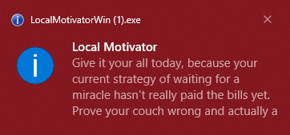
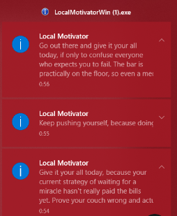

# LocalMotivatorWin
This is a small pet project created to learn Go and Windows notifications.

The program runs in the background and periodically displays motivational notifications generated with the Google Gemini API.




## Features

- Windows notifications
- Runs in the background
- Custom notification interval
- Language selection
- Simple JSON configuration

## Quick Start

1. Copy `config.json` to `config.example.json`.
2. Add your Gemini API key.
3. Build and run the application.

## Build
Build a Windows executable:

```bash
GOOS=windows GOARCH=amd64 CGO_ENABLED=0 go build -ldflags="-H=windowsgui" -o LocalMotivatorWin.exe .
```
## Technologies

- Go
- Google Gemini API
- Windows API

## License

This project is licensed under the MIT License.